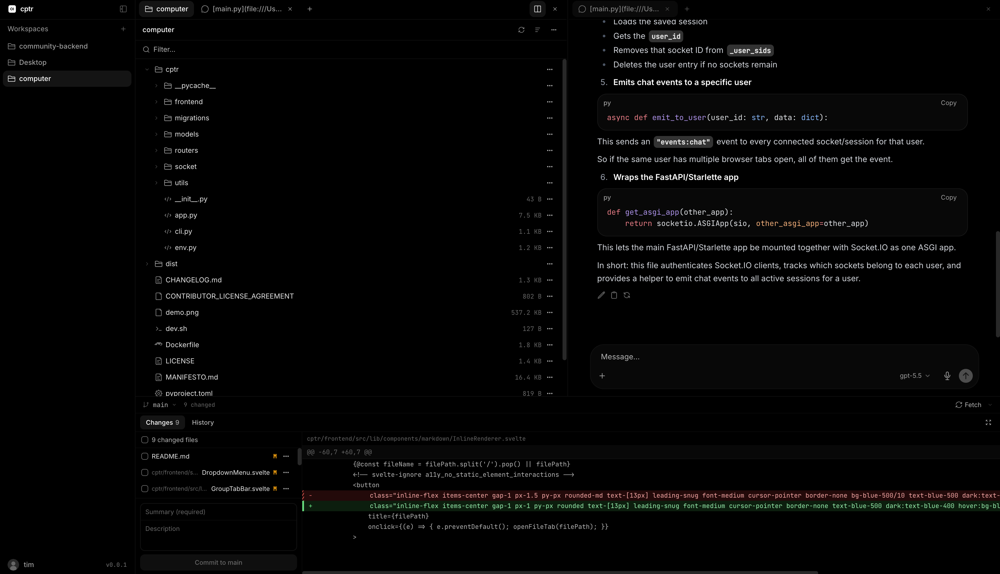

# cptr



The computer used to be a room. Then a desk. Then a bag. Now it's a URL.

Your phone goes everywhere with you. You run your life from it. Your computer used to stay home. Now it can come along.

`cptr` (short for "computer") runs on your machine and puts the whole thing in a browser tab. Pull out your phone and you're in. Files, editor, terminal, git, running on the computer you already own.

Push a hotfix from the train. Check on a deploy from bed. Ship a side project from the park. Stage and commit without touching the command line, or open the terminal and do it the old way. Search across files. Preview markdown. Drag things around. Switch between projects without losing your place.

Close the tab. Come back tomorrow on any device. Everything is where you left it. Sessions survive disconnects. Your work doesn't care which screen you're on.

Life is short. Touch grass.

## Install

```bash
pip install cptr
cptr run
```

Or with [uv](https://docs.astral.sh/uv/): `uvx cptr@latest run`

Opens in your browser at `http://localhost:8000`.

### Access from your phone

Same Wi-Fi? Bind to all interfaces:

```bash
cptr run --host 0.0.0.0
```

Open `http://<your-computer-ip>:8000` on your phone.

Not on the same network? Use a tunnel:

- **[Tailscale](https://tailscale.com)** creates a private mesh network between your devices. Recommended.
- **[Cloudflare Tunnel](https://developers.cloudflare.com/cloudflare-one/connections/connect-networks/)** gives you a permanent URL through Cloudflare's edge.
- **[ngrok](https://ngrok.com)** gives you a public URL in one command.

Or skip networking entirely and connect a [messaging bot](#messaging-bots) instead.

## What you get

| | |
|---|---|
| 📁 **File browser** | Navigate, create, rename, upload, drag and drop. Icons by type, sizes at a glance. |
| ⌨️ **Terminal** | Full shell in the browser. Run your tools, your scripts, or your favourite coding agent. |
| 🔀 **Git** | Stage, commit, diff, branch, push. Visual changes view. No command line required. |
| ✏️ **Editor** | Syntax-highlighted editing with tabs. Open multiple files side by side. |
| 🗂️ **Tabs** | Open terminals, files, chats, and tools in separate tabs. Rearrange or split your layout. |
| 📂 **Workspaces** | Multiple projects, one instance. Switch without losing your place. |
| 🔍 **Search** | Find files by name, search across file contents and chat history. ⌘K to find anything. |
| 📱 **Mobile-first** | Not a desktop UI made smaller. Built for the screen in your pocket. |
| 🔄 **Sessions persist** | Terminal keeps running when you close the tab. Come back on any device. |

## AI agent

Bring your own API key. Works with OpenAI, Anthropic, Ollama, or any OpenAI-compatible endpoint.

| | |
|---|---|
| 💬 **Chat** | Built-in AI with streaming responses and tool calling. Not just conversation: it can act. |
| 🔧 **File tools** | AI reads, writes, edits, and searches your codebase directly. |
| ▶️ **Run commands** | AI executes shell commands and reads the output. Foreground or background. |
| 🌐 **Web browsing** | Navigate pages, click elements, fill forms, take screenshots. |
| 🔍 **Web search** | Brave, DuckDuckGo, Exa, Tavily, Perplexity, or any chat completions endpoint. |
| 🖼️ **Image understanding** | AI reads and describes images and screenshots from your workspace. |
| 📋 **Plan mode** | Request an implementation plan before the AI writes a single line. |
| ✏️ **Output editing** | Review and edit AI-generated changes before applying. |
| 📎 **File mentions** | Type `@` to give the AI context about specific files. |
| 🧩 **Skills** | Reusable instruction sets (SKILL.md files). Type `$` to mention one. |
| ⏱️ **Automations** | Schedule recurring AI tasks. "Run tests every morning." "Deploy every Friday." |
| 🤖 **Sub-agents** | AI spins up parallel workers for complex tasks. Each gets full tool access. |
| 🔌 **Tool servers** | Connect external tools via MCP or OpenAPI. |
| 🧠 **Context compaction** | Long conversations are automatically summarised to stay fast. |

Already have a favourite terminal agent? Claude Code, Codex, Gemini CLI, Cursor, Grok, OpenCode, Kilo Code, and Pi all plug straight in. Use the subscription you already pay for.

## Messaging bots

Connect the AI to your chat apps. Full tool access, streaming responses, conversations synced back to the web UI.

**Telegram** · **Discord** · **Slack** · **WhatsApp** · **Signal**

Message your computer from wherever you are. Ask it to check a build, push a fix, or explain a file. Switch workspaces with `/workspace`, start fresh with `/new`.

## Gateway API

cptr exposes an OpenAI-compatible API (`/v1/chat/completions`). Any client that speaks OpenAI, including [Open WebUI](https://github.com/open-webui/open-webui), can use each cptr workspace as a model with full agent capabilities: file access, terminal, web search, tools.

## More

| | |
|---|---|
| 🎙️ **Voice memos** | Record audio, auto-transcribe to markdown. |
| 💬 **Message queue** | Queue follow-up messages while the AI is responding. |
| 🔔 **Notifications** | Browser notifications and webhooks (Slack, Discord, Teams) when tasks finish. |
| 📊 **Usage** | Token counts and timing on every response. |
| 📄 **System prompts** | Per-model, per-workspace, or global. Template variables included. |
| ⌨️ **Keyboard shortcuts** | Customisable keybindings with a settings panel. |
| 🌍 **10 languages** | EN, DE, ES, FR, JA, KO, PT-BR, RU, ZH-CN, ZH-TW. |
| 🔐 **Auth** | Username/password with JWT sessions. Signup toggle for admins. |

## Design principles

**Mobile is first-class.** The interface is built for the phone. Touch-native, portrait-native, designed for the screen people carry. Sessions survive disconnects because on a phone, they will. If a feature only works at a desk, it's not done.

**Your machine.** cptr serves the machine it runs on. The local filesystem, the local shell, local state. Where that machine lives is up to you.

**Computer, not chat.** The core is the filesystem, the terminal, and git. Files over apps. Plain files on your machine, not content trapped inside another product. AI conversations are files too: searchable, editable, movable, commit-able. cptr is a window into the real system, not a container on top of it.

Read our [Manifesto](MANIFESTO.md).


## Docker

Run cptr with Docker:

```bash
docker run --rm -it \
  -p 8000:8000 \
  -v cptr-data:/data \
  -v "$PWD:/workspace" \
  -w /workspace \
  ghcr.io/open-webui/computer:latest
```

Then open the URL printed in the logs, usually `http://localhost:8000/?token=...`.

`cptr` stores its state in `/data`. Mount your project into the container, like `-v "$PWD:/workspace"`, so cptr can access it.

The `:dev` image is also available and tracks the `main` branch.

## Security model

cptr is designed as **your computer, served to you**. Once authenticated, a user has full access to the host filesystem and shell, equivalent to an SSH session. There is no path sandboxing and no per-user isolation.

This is safe when you are the only user and you control the network. It is not safe if untrusted users share the instance, it is exposed to the public internet, or a reverse proxy forwards spoofable auth headers. Treat a shared cptr like an open SSH port.

## License

Open Use License. Source available. All rights reserved. See [LICENSE](LICENSE). [Enterprise licenses available](mailto:sales@openwebui.com).
